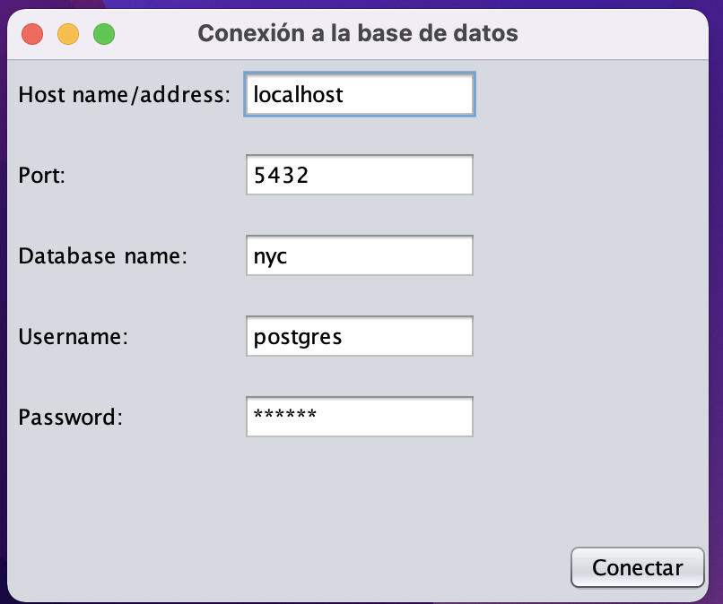
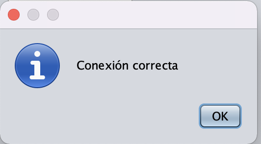
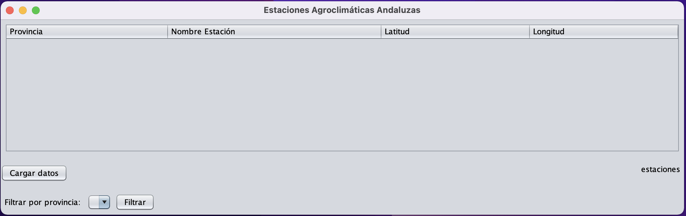
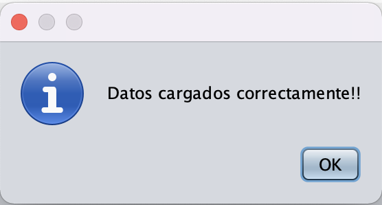
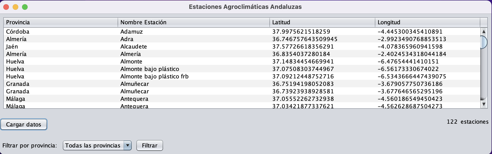
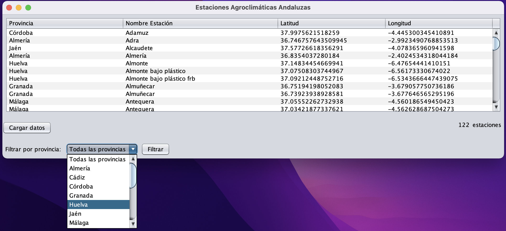

# Proyecto  Base de Datos Espaciales

## Java
Para la realizacion de este proyecto, se ha optado por usar el conocido lenguaje de programación *Java*, el cuál nos apora entre otras cosas, la posibilidad de usar un *driver* de *Postgres* con el que la conexión y las consultas a las bases de datos se realizan de manera muy sencilla. Además nos aporta librerías de diseño de interfaz gráfica, lo cuál nos ayudara a la hora de representar los datos. En cuanto al desarrollo de la aplicación se ha usado el IDE *Netbeans*, concretamente la versión 12.4. 

## Patrón de diseño Modelo-Vista-Controlador
Se ha utilizado la propuesta de arquitectura de software Modelo-Vista-Controlador (MVC), la cual se basa en separar el código en función de las responsabilidades que tenga, por lo cual nuestro modelo tendrá las siguientes capas:
- **Modelo:** contiene la funcionalidad necesaria para acceder a la información, en nuestro caso a las estaciones. 
- **Vista:** contiene las diferentes interfaces de usuario que han sido creadas con la librería *Java Swing*.
- **Controlador:** es la capa que actúa de enlace entre las vistas y los modelos. 

## Librería *Java Swing*
A la hora de la representación de los datos se ha querido hacer algo más "exclusivo" que lo que se proponía en el enunciado de la práctica, por lo que se ha optado por utilizar la librería *Java Swing*. Al estar integrada con el IDE *Netbeans* su utilización resulta bastante sencilla. Lo único que hay que tener en cuenta al utilizarla es que son contenedores (vistas) que almacenan componentes (etiquetas, campos de texto, etc.). 

## Diseño e implementación de la aplicación
### Conexión a la base de datos
Al ejecutar la aplicación lo primero que nos aparece es una ventana (*JFrame*) en el podremos introducir los parámetros necesarios para realizar la conexión a la base de datos. Por defecto, aparecen los parámetros con lo que me conecto a la base de datos desde mi ordenador. 



Si le damos al botón conectar, se intentará crear un objeto de conexión con el *URI* generado al haber rellenado esos campos y, si son correctos, nos aparecerá el siguiente mensaje. 



### Vista Principal 
Una vez que se ha realizado la conexión a la base de datos correctamente, se nos muestra la vista principal de nuestra aplicación. 



Como se puede observar aparece la tabla vacía, esto se debe a que no se han cargado los datos. 

#### Función insertar datos
Si se le dá al botón *Cargar datos* dentro de nuestra aplicación de *Java* se ejecutará el siguiente fragmento de código:

```java
public ArrayList<Estacion> listaEstaciones() throws SQLException {
        ArrayList<Estacion> lEstaciones = new ArrayList<>();

        try {
            //BLOQUE DE EXTRACCIÓN DE LOS DATOS A PARTIR DEL ENLACE DEL .TXT DE INTERNET
            URL url = new URL("http://www.uhu.es/jluis.dominguez/AGI/estaciones.txt");
            InputStream inputStream = url.openStream();
            Charset charset = Charset.forName("ISO-8859-1"); // Especifica la codificación actual del archivo
            InputStreamReader inputStreamReader = new InputStreamReader(inputStream, charset);
            BufferedReader in = new BufferedReader(inputStreamReader);
            in.readLine(); //Lee la primera fila (se la salta), la cual corresponde a los nombres de las columnas
            String line;

            //Comprueba si existe la tabla en la BD, en caso afirmativo la borra (junto a todos sus valores)
            Statement stmt = conexion.getConexion().createStatement();
            String sql = "DO $$ BEGIN IF EXISTS (SELECT * FROM information_schema.tables WHERE table_name = 'estaciones') THEN DROP TABLE estaciones; END IF; END $$;";
            stmt.execute(sql);
            sql = "CREATE TABLE estaciones (id SERIAL PRIMARY KEY,Provincia VARCHAR(255),Nombre VARCHAR(255),Latitud double precision,Longitud double precision);";
            stmt.execute(sql);

            while ((line = in.readLine()) != null) {
                //Separa los valores de la línea por comas
                StringTokenizer st = new StringTokenizer(line, ",");
                Estacion estacion = new Estacion();

                if (st.countTokens() == 4) {
                    estacion.setProvincia(st.nextToken());
                    estacion.setNombre(st.nextToken());

                    //Conversión de UTM a coordenadas geográficas
                    CRSFactory factory = new CRSFactory();
                    Projection utmProjection = factory.createFromName("EPSG:32630").getProjection();
                    ProjCoordinate utmCoordinate = new ProjCoordinate(Double.parseDouble(st.nextToken()), Double.parseDouble(st.nextToken()));
                    ProjCoordinate latLonCoordinate = new ProjCoordinate();
                    utmProjection.inverseProject(utmCoordinate, latLonCoordinate);
                    double lat = latLonCoordinate.y;
                    double lon = latLonCoordinate.x;

                    estacion.setLatitud(lat);
                    estacion.setLongitud(lon);

                    //Inserción de los valores en la BD 
                    sql = "INSERT INTO estaciones (Provincia, Nombre, Latitud, Longitud) VALUES ('" + estacion.getProvincia() + "', '" + estacion.getNombre() + "'," + estacion.getLatitud() + ", " + estacion.getLongitud() + ");";
                    stmt.execute(sql);
                }

                lEstaciones.add(estacion);
            }
            in.close();
        } catch (IOException e) {
            e.printStackTrace();
        }

        return lEstaciones;
    }
```

Como se puede observar el flujo de ejecución sería el siguiente: 
1. Se realiza la "conexión" con el fichero `.txt` que se encuentra en la *URL*.
2. Comprueba si existe previamente la tabla en la base de datos a la que estamos conectados, en caso de que exista la borra.
3. Crea la tabla *estaciones* con sus respectivas columnas de datos: provincia, nombre, latitud y longitud. 
4. Lee línea a línea del contenido de la *URL* y las separada en tokens (en función de las comas). 
5. Hace una comprobación de que el número de tokens sea igual a 4, para comprobar que se está leyendo de manera correcta. 
6. Asigna los valores *provincia* y *nombre* a un objeto de tipo *estacion* 
7. Hace la conversión de UTM a coordenadas geográficas mediante el uso de la librería *proj4j*.
8. Hace la inserción de la tupla correspondiente a la línea leida del archivo `.txt` en la base de datos.
9. Finalmente los añade a una lista de estaciones que será devuelta por el método y será usado para rellenar el contenido de la tabla vista en la imagen anterior. 

Si todo ha ido bien a la hora de la ejecución del método se nos mostrará el siguiente mensaje: 



Y entonces, a partir la lista de estaciones devuelta en el método se rellena el *JTable* que al principio estaba vacío. 

También, se rellenará de forma automática el *JComboBox* con todas las provincias disponibles para poder realizar un filtrado de la información. Éste se rellena haciendo uso del siguiente método en *Java*:

```java
public ArrayList<String> listadoProvincias() throws SQLException {
        ArrayList<String> provincias = new ArrayList<String>();
        Statement stmt = conexion.getConexion().createStatement();
        String sql = "SELECT provincia FROM estaciones GROUP BY provincia ORDER BY provincia;";
        ResultSet rs = stmt.executeQuery(sql);

        while (rs.next()) {
            provincias.add(rs.getString("provincia"));
        }

        return provincias;
    }
```



#### Función consultar datos
Una vez que se han cargado los datos en la base de datos y en el *JTable* junto a las provincias en el *JComboBox*, tenemos la opción disponible de hacer una consulta de las estaciones en función de las provincias en la que se encuentren. 



Cuando tenemos la provincia seleccionada y pulsamos el botón filtrar, ahora nos aparecerá en la tabla aquellas estaciones cuya provincia sea la seleccionada. 


La consulta se ha implementado en *Java* de la siguiente manera: 

```java
public ArrayList<Estacion> filtradoProvincia(String provincia) throws SQLException {
        ArrayList<Estacion> estaciones = new ArrayList<Estacion>();
        Estacion estacion = null;
        Statement stmt = conexion.getConexion().createStatement();
        String sql = "SELECT * FROM estaciones";

        if (!provincia.equals("Todas las provincias")) {
            sql += " WHERE provincia='" + provincia + "';";
        }

        ResultSet rs = stmt.executeQuery(sql);

        while (rs.next()) {
            estacion = new Estacion();
            estacion.setProvincia(rs.getString("provincia"));
            estacion.setNombre(rs.getString("nombre"));
            estacion.setLatitud(rs.getDouble("latitud"));
            estacion.setLongitud(rs.getDouble("longitud"));

            estaciones.add(estacion);
        }

        return estaciones;
    }
```